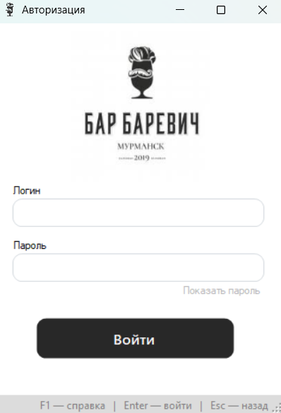

# 🍸 Учет бронирования мест и движения продуктов — ООО «Бар Баревич»

> Программное обеспечение для автоматизации работы бара, включающее учет бронирования столов, заказов, мероприятий и движения продуктов.

---

## 📖 О проекте

Проект «**Учет бронирования мест и поступления и расхода продуктов в ООО Бар Баревич**» создан для упрощения и систематизации работы персонала бара.  
Программа автоматизирует основные процессы, снижает количество ручных операций и повышает точность учета.

Реализация системы обеспечивает:
- оптимизацию работы сотрудников;
- быстрый доступ к актуальной информации;
- формирование отчетных документов;
- повышение прозрачности учета поступления и расхода продуктов.

---

## ⚙️ Основные функции

### 📚 Ведение справочников:
- Мероприятия  
- Должности сотрудников  
- Категории меню  
- Статусы выдачи меню  
- Единицы измерения  
- Причины списания продуктов  

### 🧾 Управление данными:
- Клиенты  
- Столы  
- Сотрудники  
- График работы сотрудников  
- Меню  
- Мероприятия  
- Бронирования  
- Меню в бронировании  
- Продукты  
- Заказы продуктов  
- Поставки продуктов  
- Списания продуктов  

### 🔍 Отбор и фильтрация:
- Поиск клиентов по фамилии или номеру телефона  
- Фильтрация бронирований по дате или столу  
- Отбор пунктов меню по категории или названию  
- Поиск продуктов по названию  
- Отбор заказов, поставок и списаний по дате или типу  

### 💰 Расчеты и отчеты:
- Расчет стоимости заказа  
- Учет поступивших, списанных и использованных продуктов  
- Формирование отчетов:
  1. Информация о посещениях и вкусовых предпочтениях  
  2. Информация о списанных продуктах  
  3. Информация о производственном расходе  
  4. Реестр заказов продуктов  

### 🔐 Авторизация:
- Вход пользователей по логину и паролю  
- Разграничение ролей (администратор, официант, бармен, барбек)

---

## 🧩 Используемые технологии

| Компонент | Описание |
|------------|-----------|
| **Язык** | C# |
| **Среда разработки** | Visual Studio |
| **База данных** | MySQL |
| **Тип приложения** | Windows Forms |
| **Библиотеки** | `MySql.Data`, `Guna.UI2` |

> ⚠️ Интерфейс проекта использует библиотеку **Guna.UI2**.  
> Для использования в коммерческих целях требуется соответствующая лицензия.

---

## 🖼️ Скриншоты

```html
<p align="center">
  
</p>
